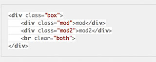

### 怎么在markdown中添加代码作为内容中的一个区块，能使代码高亮显示并且不被解析

我主要在两个地方使用了markdown，现在说说这两个地方的实现。

第一种情况，我是在Github上使用markdown，主要是写文档，但我的一些文旦给，又大多和代码有关，就难免会粘贴一些代码到文档中，刚开始直接贴一些代中文档中，直接就被文档给解析了，我想要的效果没有出来，可是难坏了我。

后来在网上查了一些资料，终于搞明白了。

在github中的markdown文档插入代码，并使代码作为内容块高亮显示，其实很简单。在我们需要加入代码的地方连续输入模板字符串(就是键盘左上角的`,1左侧的那个不常用的键)，然后跟上要输入的代码类型，比如```html,最后在代输入结束后再连续输入3个模板字符串结束。

<pre>
```lang
    //代码
```
</pre>

看下面几个例子：
```html
<div class="box">
    <div class="mod">mod</div>
    <div class="mod2">mod2</div>
    <br clear="both">
</div>
```

css代码:
```css
.box {
    width: 400px;
    margin: 0 auto;
    padding: 20px;
    background-color: #00f;
    border: 1px solid #000;
}
```
less代码:
```less
@color: #369;
@baseFontSize: 14px;
#header {
  h1 {
    font-size: @baseFontSize;
    color: @color;
    font-weight: bold;
  }
  p {
    font-size: 12px;
    a {
      text-decoration: none;
      &:hover {
        color: #333;
      }
    }
  }
}
```
js代码:
```javascript
function logTasks(env, localGulp) {
  var tree = taskTree(localGulp.tasks);
  tree.label = 'Tasks for ' + chalk.magenta(tildify(env.configPath));
  archy(tree)
    .split('\n')
    .forEach(function(v) {
      if (v.trim().length === 0) {
        return;
      }
      gutil.log(v);
    });
}
```
java代码:
```java
public class Main {
    public static void main(String[] args){
        String str = "We are happy!";
        System.out.println(spaceReplace(str));
    }

    public static String spaceReplace(String str){
        return str.replace(" ", "%20");
    }
}
```

上面的几个例子，都是写少的markdown直接再github上使用，代码的高亮效果直接就出来了。然而很多适合我们写的markdown并不是在github上使用，比如我经常在我的工作电脑上使用mou来编辑markdown。

这个时候，上面的方式就不行了，这个时候可以看借助highlight.js插件。

在markdown文件的顶部引入插件必要的依赖文件。

#### highlight.js插件的引入方式

可以参考插件官网[https://highlightjs.org/usage/](https://highlightjs.org/usage/)的说明文档，主要有2种方式：

1. CDN

   可以使用官网提供的CDN地址，也可以通过其他的的CDN提供的，这中方是依赖性很强，如果别人的CDN变了，你的应用也就不能用了，不建议使用。

2. 下载highlight.js插件库

   下载highlight.js插件库到到本地，放在和markdown文件相关联的地方，在markdown文件的顶部引入必须的依赖文件css和js，如下：
    <pre>
    <code>
    &lt;link rel="stylesheet" href="./lib/styles/default.css" &gt;
    <script src="./lib/highlight.pack.js"></script>
    <script>hljs.initHighlightingOnLoad();</script>
    </code>
    </pre>

    ```html
    <div class="box">
        <div class="mod">mod</div>
        <div class="mod2">mod2</div>
        <br clear="both">
    </div>
    ```

    实现效果

   

