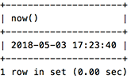
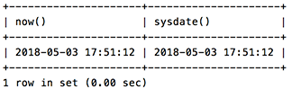
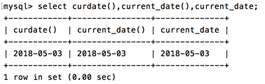
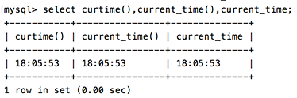
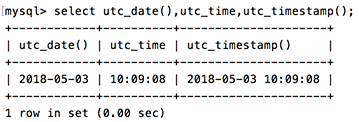
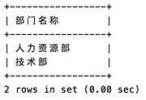

#### 获取当前时间

1. 获取当前时间+日期(date + time): now()

```sql
select now();
```

执行结果如下：



另外还有下面几个函数和now()函数的作用完全相同：
current_timestamp()、localtime()、localtime、localtimestamp()、localtimestamp。

这5个时间函数的作用和now()相同，但是now()比较起来容易记忆，所以平时用到的也是最多，也建议使用now()来实现该功能。

2. 获取当前时间+日期: sysdate()

sysdate()和now()非常类似，不同的地方是now()在执行开始时就得到值了，sysdate()是在函数执行时动态得到值(这个解释有点模糊，还没有搞清楚)。

```sql
select now(),sysdate();
```



3. 获取当前日期：curdate()

另外也有current_date()、current_date两个函数可以是想同样效果，可以获取到当前日期。

```sql
select curdate(),current_date(),current_date;
```



4. 获取当前时间: curtime()

这个函数和上面的curdate()很相似，也有2个函数可以实现获取当前的函数，分别为current_time()、current_time;

```sql
select curtime(),current_time(),current_time;
```



5. 获取UTC时间及日期的方式

utc_date() 获取日期

utc_time() 获取时间

utc_timestamp() 获取日期+时间

```sql
select utc_date(),utc_time,utc_timestamp();
```



#### 附加项：为字段取别名

在查询数据时，为了使查询的结果显示的更加直观，我们可以为查询的字段取一个名字。

方式：

select 字段名 as 别名[,字段名 as 别名……] from 表名;

```
为字段指定别名，关键字as可以省略
```

```sql
select name as 部门名称 from department;
select name 部门名称 from department;
```

上面2条sql语句，分别为没有缺省as关键字方式为字段取别名和省略了关键字as的方式为字段取别名，执行结果相同：


