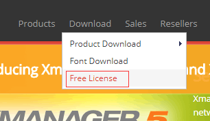

前一段时间从xshell官网下载了xshell完成安装，使用非常方便，可用了一段时间后，发现试用期结束后，就不能使用了，重新下载也不行，要么退出软件的运行，要么就是去官网购买正版。
我支持正版，去了官网一看，正版好贵啊，好像是899吧，然后还有免费版的。免费版的已经满足我的需求了，就没有必要花这个钱了。

```
我的使用场景是windows，mac下还是有点不同的
```

#### 进入官网下载

官网 [http://www.netsarang.com](http://www.netsarang.com)

然后进入下载页，位置如下(因为是免费的，在下载之前，网站会收集一些个人信息)：



进入下载页后，我们选择Xshell下载


接下来就该填写注册信息了，


这里的邮箱一定要填写对，因为Xshell的下载地址是要发送到这个注册邮箱的。

```
不知道别的邮箱什么情况，我用的是163邮箱，结果别我发到垃圾箱里了。我们注册完成后如果网站提示我们已经将下载地址发送我们邮箱了但我们等了一会没有收到邮件的时候，可以去垃圾邮件中去看看。
```

这里都下载完了，直接安装就可以了。windows下的安装，没有什么特殊情况，一路下一步就完事了。