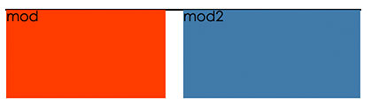

# h5 清除浮动
### 浮动现象


如图所示，两个模块的父容器，没有被两个子元素mod和mod2撑开，父容器的样式没有展示出来。

###  浮动产生原因
一般情况下是，一个容器中的子元素使用了浮动，如示例中的现象，父容器中的两个子元素，一个使用了左浮动，一个使用了右浮动，导致父容器没有被撑开；如果两个子元素都是左浮动或者都是右浮动，父容器也是不会被撑开的。

简单的说，浮动就是因为元素使用了float:left;或者float:right;引起的。

### 浮动带来的弊端
就像示例图表示的一样，该有的样式没有表现出来。具体来说，有几个方面：

1. 父容器的背景色不能表现出来；
2. 父容器的边框不能正确的表现出来；
3. 父容器的padding值不能被正确的方式展现；

### 怎么清除浮动

1. 设置高度
	
	既然产生浮动问题后的表现是父容器的高度没有被撑开，那么为父容器设置一个高度，问题就解决了。不过这种解决方式的灵活性不好，实际中很少使用。

<link rel="stylesheet" href="//cdnjs.cloudflare.com/ajax/libs/highlight.js/9.12.0/styles/default.min.css">
<script src="//cdnjs.cloudflare.com/ajax/libs/highlight.js/9.12.0/highlight.min.js"></script>
<script>hljs.initHighlightingOnLoad();</script>

```
	<div class="box">
        <div class="mod">mod</div>
        <div class="mod2">mod2</div>
    </div>
```
	

	

2. 通过为父元素设置overflwo:hidden;


3. 父容器使用伪类;


4. 使用clear:both;


5. html子元素后面添加一个空标记