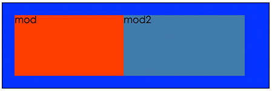

# 清除浮动
### 浮动现象


而我们预期的效果是这样的:



如图所示，两个模块的父容器，没有被两个子元素mod和mod2撑开，父容器的样式没有展示出来。

###  浮动产生原因
一般情况下是，一个容器中的子元素使用了浮动，如示例中的现象，父容器中的两个子元素，一个使用了左浮动，一个使用了右浮动，导致父容器没有被撑开；如果两个子元素都是左浮动或者都是右浮动，父容器也是不会被撑开的。

简单的说，浮动就是因为元素使用了float:left;或者float:right;引起的。

### 浮动带来的弊端
就像示例图表示的一样，该有的样式没有表现出来。具体来说，有几个方面：

1. 父容器的背景色不能表现出来；
2. 父容器的边框不能正确的表现出来；
3. 父容器的padding值不能被正确的方式展现；

### 怎么清除浮动

1. 设置高度
	
   既然产生浮动问题后的表现是父容器的高度没有被撑开，那么为父容器设置一个高度，问题就解决了。不过这种解决方式的灵活性不好，实际中很少使用。

    html结构如下:
    ```html
    <div class="box">
        <div class="mod">mod</div>
        <div class="mod2">mod2</div>
    </div>
    ```
	css样式如下:
	```css
	.box {
        width: 400px;
        height: 100px;
        margin: 0 auto;
        padding: 20px;
        background-color: #00f;
        border: 1px solid #000;
    }
    .mod,.mod2{
        float: left;
        height: 100px;
    }
    .mod{
        width: 180px;
        background-color: #f20;
    }
    .mod2{
        width: 200px;
        background-color: #369;
    }
	```
    因为为父容器box设置了高度，但是子容器mod和mod2的内容不固定，具有很大的不确定性，所以这种清除浮动的方式的扩展性和灵活性有限。清除浮动后的效果:

    

2. 通过为父元素设置overflwo:hidden;

    通过为父容器设置样式overflow:hidden;也可以达到清除浮动的目的。
    html结构代码如下:
    ```html
    <div class="box">
        <div class="mod">mod</div>
        <div class="mod2">mod2</div>
    </div>
    ```
    css样式代码如下：
    ```css
    .box {
        width: 400px;
        margin: 0 auto;
        padding: 20px;
        background-color: #00f;
        border: 1px solid #000;
        overflow: hidden;
    }
    .mod,.mod2{
        float: left;
        height: 100px;
    }
    .mod{
        width: 180px;
        background-color: #f20;
    }
    .mod2{
        width: 200px;
        background-color: #369;
    }
    ```
    这种方式简单有效，但也有一定的弊端，就是在个别的场景下，我们可能需要在子元素mod或mod2中有一个浮在文档流之上的效果，如果这个效果超出了父容器的边界，那么这个浮层就会被父容器的overflow:hidden;给截掉，导致了效果的缺失。

    虽然通过为父容器添加overflow:hidden;的方式有一定的弊端，但是出现意外的场景并不是很多，这种解决浮动问题的方式使用率还是很高的。


3. 父容器使用伪类;

   html结构代码如下:
   ```html
   <div class="box">
       <div class="mod">mod</div>
       <div class="mod2">mod2</div>
   </div>
   ```
   css样式代码如下:
   ```css
   .box {
       width: 400px;
       margin: 0 auto;
       padding: 20px;
       background-color: #00f;
       border: 1px solid #000;
   }
   .box:after{
       clear: both;
       display: block;
       content: "";
   }
   .mod,.mod2{
       float: left;
       height: 100px;
   }
   .mod{
       width: 180px;
       background-color: #f20;
   }
   .mod2{
       width: 200px;
       background-color: #369;
   }
   ```
   这种方式还是不错的，就是添加了几行css代码，对html结构没有任何的改动，也不会因为入容器的overflow:hidden;而可能会对后来的效果造成影响。


4. 使用clear:both;

   这种方式是在html中的两个子元素后面后面添加一个空的标记，而给这个空的标记设置一个样式: clear:both;
   html结构如下:
   ```html
   <div class="box">
       <div class="mod">mod</div>
       <div class="mod2">mod2</div>
       <div class="clear"></div>
   </div>
   ```
   css样式如下:
   ```css
   .clear{
       clear: both;
   }
   .box {
       width: 400px;
       margin: 0 auto;
       padding: 20px;
       background-color: #00f;
       border: 1px solid #000;
   }
   .mod,.mod2{
       float: left;
       height: 100px;
   }
   .mod{
       width: 180px;
       background-color: #f20;
   }
   .mod2{
       width: 200px;
       background-color: #369;
   }
   ```
   这种方式也可以清除浮动，但美中不足的是在html结构代码中添加了一个空的html标记，这个标记没有任何数据表示上的意义，仅仅是为了引用clear:both;的一个样式。如果套页面的同学不小心，或者套页面的同学不熟悉html代码的话，这里会造成困惑，可能会导致一些意外的错误。

5. html子元素后面添加一个空标记

   现在的这种方式和上面的一种方式基本相同给，也是在html结构种的浮动的元素后面添加一个空的html标记，不同的是前面一种方式是借用css样式来解决浮动，现在是借用dom属性的方式来解决浮动。

   html结构代码如下:
   ```html
   <div class="box">
       <div class="mod">mod</div>
       <div class="mod2">mod2</div>
       <br clear="both">
   </div>
   ```
   css样式如下：
   ```css
   .box {
       width: 400px;
       margin: 0 auto;
       padding: 20px;
       background-color: #00f;
       border: 1px solid #000;
   }
   .mod,.mod2{
       float: left;
       height: 100px;
   }
   .mod{
       width: 180px;
       background-color: #f20;
   }
   .mod2{
       width: 200px;
       background-color: #369;
   }
   ```
   对于后两种清除浮动的方式，不太建议使用，因为我们不能不能保证我们提供页面以后的使用者都是很懂html(有很多人不管懂还是不懂，看也不看，上来就改)，所以html结构，一定要做到清晰易懂。