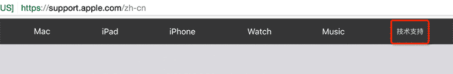
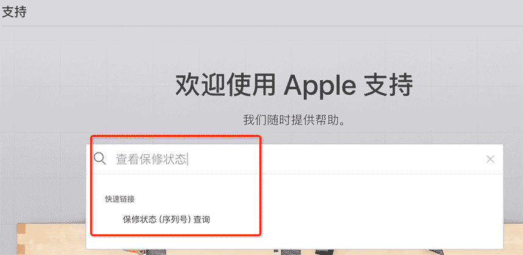
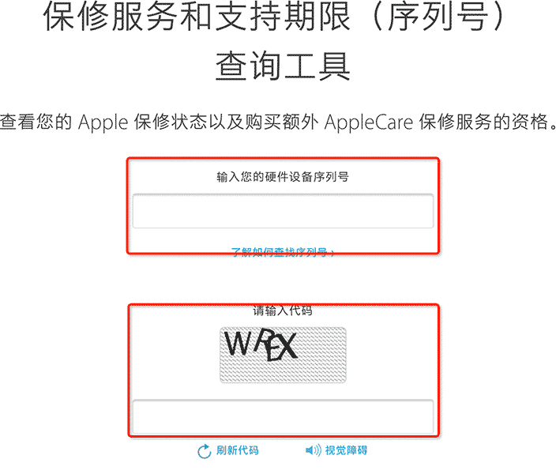

### 苹果产品保修期查询

1. 进入苹果官网

2. 点击导航部分最后一个“技术支持”,进入“技术支持”页面

    

3. 在“技术支持”页面的导航下面的搜索框输入“查看保修状态”或者“保修状态查询”等相关的关键词查询，进入“查看保修状态”页面

    

4. 根据要求输入设备的序列号和验证码，即可查询

    

5. 输入了序列号和验证码后，就可以查看查询结果了

### 苹果设备的序列号查询

    > 以iphone为例

1. 依次打开设置——通用——关于本机

2. 在“关于本机”界面找“序列号”项

    序列号的查询比较简单，没有截图
